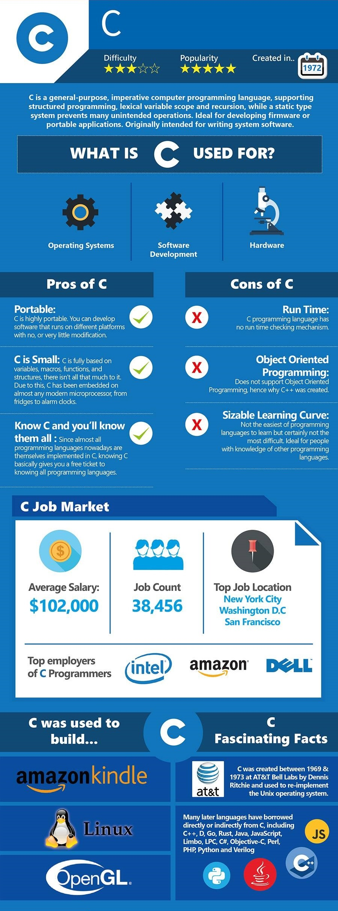

# zhengrr 所知的 C                                                   {#mainpage}

> [](https://byrslf.co/188a5bdc9f54 "Should You Learn Python, C, or Ruby to Be a Top Coder?")

> ```c
> #include <stdio.h>
>
> main( ) {
>         "hello, world\n"
> }
> ```
>
> *The C Programming Language*

[*C*](http://open-std.org/jtc1/sc22/wg14/ "ISO/IEC JTC1/SC22/WG14 - C")
| [*C18*](https://iso.org/standard/74528.html "ISO/IEC 9899:2018"),
  [*C11*](https://iso.org/standard/57853.html "ISO/IEC 9899:2011"),
  [*C99*](https://iso.org/standard/29237.html "ISO/IEC 9899:1999"),
  [*C95*](https://iso.org/standard/23909.html "ISO/IEC 9899:1990/Amd 1:1995"),
  [*C90*](https://iso.org/standard/17782.html "ISO/IEC 9899:1990"),
  [*ANSI C*](https://ansi.org/search_results?q=ANSI+X3.159-1989 "ANSI X3.159-1989"),
  [K&R C](# "K&R C, 1978"),
  [Early C](# "Early C, 1972")

Dennis MacAlistair Ritchie（丹尼斯·麦卡利斯泰尔·里奇）
Kenneth Lane Thompson（肯尼斯·蓝·汤普逊）

## 参考

*   [“C 参考手册”](https://zh.cppreference.com/w/c). *cppreference.com*.

## 风格

*   [*Linux kernel coding style*](https://github.com/torvalds/linux/blob/master/Documentation/process/coding-style.rst)

## 指南

*   *C Interfaces and Implementations: Techniques for Creating Reusable Software*. 1997. David R. Hanson.
*   [*The C Library Reference Guide*](https://www-s.acm.illinois.edu/webmonkeys/book/c_guide). 1997. Eric Huss.
*   *C Programming: A Modern Approach.* 1st ed. 1996; [2nd ed.](http://knking.com/books/c2) 2008. K. N. King.
*   *The C Programming Language*. 1st ed. 1978; 2nd ed. 1988. Brian Kernighan; Dennis Ritchie.
*   *C Traps and Pitfalls*. 1989. Andrew Koenig.
*   *Expert C Programming: Deep C Secrets*. 1994. Peter van der Linden.
*   [*Implementing Exceptions in C*](http://hpl.hp.com/techreports/Compaq-DEC/SRC-RR-40.pdf). 1989. Eric. S. Roberts.
*   *Pointers on C*. 1997. Kenneth Reek.
*   *The Standard C Library*. 1992. P. J. Plauger.

## Awesome

[*Awesome C*](https://notabug.org/koz.ross/awesome-c)

| [*Check*](https://libcheck.github.io/check)
| [*FFmpeg*](https://ffmpeg.org/)
| [*Kafka*](https://kafka.apache.org/)
| [*libhdfs*](https://hadoop.apache.org/docs/current/hadoop-project-dist/hadoop-hdfs/LibHdfs.html)
| [*librdkafka*](https://github.com/edenhill/librdkafka)
| [*libuv*](https://libuv.org/)
| [*hiredis*](https://github.com/redis/hiredis)
| [*OpenAL*](https://openal.org/)
| [*OpenCL*](https://khronos.org/opencl/)
| [*OpenGL*](https://opengl.org/)
| [*OpenSSL*](https://openssl.org/)
| [*PJSIP*](https://pjsip.org/)
| [*POSIX*](https://wikipedia.org/wiki/POSIX)
| [*rabbitmq-c*](https://github.com/alanxz/rabbitmq-c)
| [*Tesseract*](https://github.com/tesseract-ocr/tesseract)
| [*ZooKeeper*](https://zookeeper.apache.org/)

## 许可

项目采用 Unlicense 许可，文档采用 CC0-1.0 许可：

<p xmlns:dct="https://purl.org/dc/terms/">
  <a rel="license"
     href="https://creativecommons.org/publicdomain/zero/1.0/">
    
  </a>
  <br />
  To the extent possible under law,
  <span resource="[_:publisher]" rel="dct:publisher">
    <span property="dct:title">zhengrr</span></span>
  has waived all copyright and related or neighboring rights to this work.
</p>
